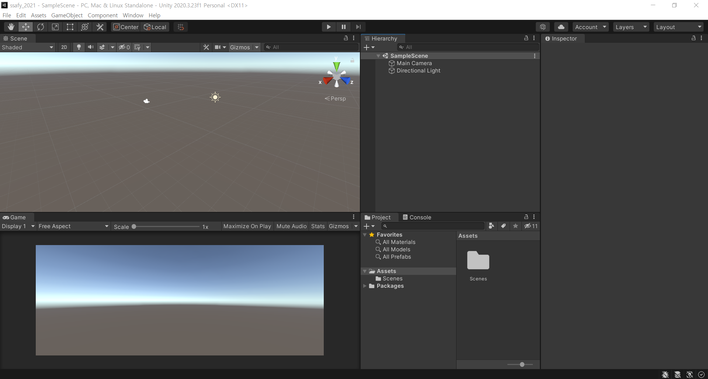

# Unity

## Real-time engine

애니메이션, 디자인 또는 그래픽과 같은 시각화를 즉시 생성할 수 있게 해주는 도구

🤔 필요한 이유?

제품 제작 전 디자인 오류를 줄이기 위해 실시간 렌더링이 중요

몰입형 기술로 제품 디자인을 경험해보는 것이 디자인 프로세스에 중요

게임, 디자인, 제조, 건출, 가상현실, 증강현실, 교육, 회의, 영화 등에 이용

### Trends in REAL-TIME Rendering

아우디 디지털 쇼룸(그림자, 반사 등을 구현)

할리우드 VR 체험

아키텍처 렌더링

✅ 오프라인 렌더링 기술 : 실제 시제품을 만드는 기술 or 3D 디자인 툴로 작업하는 것

## Offline Rendering vs Real-time Rendering

### Offline Rendering

노가다로 한땀한땀 디자인해서 메테리얼이나 텍스쳐 같은 것을 씌워주는 것

렌더링 시간

- Image Rendering - 렌더링 시간만(빌드) 8시간 이상
- Video Rendering - 3분 비디오가 37시간

### Real-time Rendering

실시간 엔진을 이용하여 편리하게 만드는 것

렌더링 시간

- Image Rendering - 렌더링 시간이 0.1초
- Video Rendering - 10

새로운 오브젝트를 추가하거나 삭제, 재질이나 조명 변경이 쉽다

종류

- Unreal Engine

  실감 있는 Real-Time 3D(RT3D) 개발 환경을 제공하는 통합형 게임 엔진(ex. 배그)

- Unity Engine

  전세계에서 가장 널리, 많이 사용되는 Real-Time 3D(RT3D) 개발 플랫폼

## Unreal Engine vs Unity Engine

둘 다 온라인 마켓이 존재 → 기본적인 에셋을 구매 가능(import)

Unrreal 마켓이 상대적으로 활성화된 기간이 절반이라 아직까지 적다.

### Unreal Engine

C++

복잡한 로직을 통해 재질이나 음영을 제작해야한다.

처음 할 때 시간이 많이 걸린다.

품질 면에서 고퀄리티를 제공한다.

난이도 상

### Unity Engine

C#

메테리얼이나 쉐이더를 기본적으로 제공(재질, 음영) → 빠르게 개발 가능, 접근성이 좋다.

업데이트를 통해 퀄리트를 높이고 있다.

난이도 중

## 설치

Google Unity 검색 → Unity Hub 다운로드

- Unity Hub : 유니티의 버전을 관리해주는 플랫폼(버전이 매우 많음)
- 버전 호환을 잘 안해주는 단점이 있다. → 버전을 잘 맞춰서 프로젝트를 진행해야 한다.

권장 LTS를 설치하는 것을 추천!

- Microsoft Visual Studio Community 설치(미설치인 경우)
- 윈도우인 경우 Android Build Support 설치(Android SDK & NDK Tools, OpenJDK 설치)
- Documentation 설치

아이폰에서 빌드하려면 맥북을 사용해야 하고 윈도우에서는 안드로이드만 빌드 가능하다.

## 학습

Roll-a-Ball과 같은 교육 프로그램들이 있다.

커뮤니티에 Unity에서 준비하는 발표와 커뮤니티 등이 있다.

블로그에서는 최신 기능과 공지 등을 알려준다.

## 프로젝트 생성

명확하게 알아볼 수 있는 이름으로 만든다.

새로생성에서 화살표를 누룬 뒤 버전을 선택 → 템플릿 선택(2D, 3D 등)

무겁기 때문에 import할 때 많은 시간이 걸린다(이름 실수하지 말 것!!)

가상현실, 증강현실 등도 3D로 구현

프로젝트 경로나 이름에 한글 포함 금지, 띄어쓰기 금지

### File → Build Settings

pc로 하면 exe 파일로 생성된다.

안드로이드와 iOS를 따로 만들 필요 없이 하나의 코드로 같이 빌드할 수 있다(장점)

Univertial Window Platform : 영화에서 사용할 만한 고차원적 렌더링

PS4 : 플레이 스테이션

Xbox : 게임기

✅ 오큘러스에서 이용하려면 안드로이드로 빌드(안드로이드 기반으로 만들어짐)

### Edit

play : 컴파일이라고 생각 - 사용자가 바라보는 화면(게임에서 카메라가 바라보는 화면)

## 실습

🥕 화면을 끌어서 레이아웃 수정이 가능하다.

- 수정한 레이아웃 모습

  

​		Main Camera와 Directional Light는 하나의 오브젝트이다.

SampleScene에서 우클릭으로 3D 객체를 추가할 수 있다(ex. cube, Sphere 등)

생성 후 움직여보면 Game에서도 움직이는 것을 볼 수 있다. → Game을 실행하면 카메라가 바라보는 방향을 바라본다.

회전을 시키려면 툴 박스(메뉴바 아래)를 사용해야 한다.

회전, 스케일, 포지션 등을 변경할 수 있다.

보통 Hand Tool, Move Tool, Rotate Tool, Scale Tool을 많이 사용 → 단축키 순서대로 q, w, e, r

화면 돌리기 : 마우스 오른쪽

### Inspector

Transform : 이동에 관한 모든 것

Mesh : 감싸고 있는 망

Mesh Renderer : 겉면을 감싸고 있는 재질(체크를 꺼서 안보이는 경우에도 물체는 살아있다, 그림자는 안보임)

- 색을 입힐 때에는 Project에서 우클릭 → Create → Material → 색 선택 → 끌어서 원하는 객체에 넣기

Material : 해당 객체를 감싸고 있는 재질, 색상, 질감, 텍스쳐를 표현

Box Collider : 충돌하는 영역으로 초록색으로 보인다. Mesh가 꺼지고 Collider가 남아있으면 충돌체만 남아 있는 것!

Add Component를 통해 Collider를 추가할 수 있다.

## Asset

create → C# Script를 통해 움직이게 할 수도 있다.

## Game Object

게임을 만드는 Object

그냥 Object와는 명칭 차이

Effects : 효과(ex. 총 쏠 때 터지는 효과)

Light : 유니티에서 빠질 수 없는 효과 → 불을 켜야 본연의 색을 띈다.

- 큰 Cube 같은 오브젝트로 빛을 막는 것도 가능하다.
- 빛을 밝게 하거나 전체에서 오게 해서 그림자를 사라지게 할 수 있다.

Main Camera 오브젝트는 반드시 한개 이상 있어야 한다(Scene 하나당)

- 카메라가 물체를 따라오게 할 수 있다.
  - 상속 개념 설정(많이 사용)
  - ex)Cube 밑에 Sphere를 붙이기, Cube 밑에 카메라 붙이기
  - 캐릭터 오브젝트를 계속 추적해야 할 때 사용한다.

## 온라인 스토어

https://assetstore.unity.com/

애니매이션, 캐릭터, 주변 환경 등 많은 3D 오브젝트가 있다.

3D 외에도 2D, 오디오, 템플릿 등이 있다.

무료 / 유료로 사용할 수 있다(가격 설정)

디자이너가 아니더라도 3D 환경을 구축하고 활용할 수 있다.

### import 하는 방법

선택 → 내 에셋 추가 → Unity Edit에서 열기 → Unity의 Package Manager가 자동으로 열림 → download → import

이후에 캐릭터들도 추가할 수 있다.

- 같은 방법으로 import → FBXs나 Prefabs에 가서 드래그에 드롭으로 가능

캐릭터에 Animator가 있다면 애니매이션(fbx에 있는 네모 아이콘)을 Controller에 추가하여 쓸 수 있다.

추가 후 재생을 누르면 움직인다.

에셋에서 애니매이션만 가져올 수도 있다.

✅ 여러개의 동작이 있을 때 동작 선택은 어떻게 선택 하는지?

- 애니매이션(fbx에 있는 네모 아이콘)을 더블 클릭하면 여러개가 보인다.
- 레이어를 추가하여 설정한다.
- 원하는 동작을 연결시키고 링크를 통해 이어서 하도록 한다.
- 코드로 작성해야 한다..

## C# Script를 이용하여 코드를 작성

유니티는 C# 기반 → Visual Studio를 설치한 이유

**void Start()**

- 시작하자마자 호출되는 함수
- 30fps = 1초당 30번의 frame(30 frame per seconds)

**void Update()**

- 프레임마다 한번씩 호출(실시간 반응)
- ex)키보드 입력 값을 받아서 이동하는 경우

리소스 관리를 잘 해야한다!!

다른 함수도 void로 선언 가능하다.

✅ C# Script를 눌렀을 때 비쥬얼 스튜디오 코드가 안켜진다면?

Edit → Preferences → External Tools → Visual Studio Community 클릭

### 에셋에서 가져오기 힘든 모델링을 하는 경우

Hierarchy에서 오른쪽 클릭 → 3D object 추가

✅ Visual Studio Code를 사용해도 되지만 같은 툴을 사용하는 것이 편하기 때문에 Visual Studio Community를 사용한다(Editor 통일)

- Visual Studio Community : 자동 완성 기능을 사용할 수 있다. ex)using UnityEngine

Hierarchy를 통해 하나로 관리 가능 → **상속 개념 중요!**

- Create Empty : 빈 게임 오브젝트 생성
  - 생성 후 이름을 바꾸고 만든 오브젝트들을 하위로 넣어준다.

Object를 더블 클릭하면 그 오브젝트에 가까이 가게 된다.

- 메인 카메라를 더블 클릭, 위치 조정하여 원하는 부분을 보여지게 할 수 있다.

공간 다루는 것이 익숙해져야 한다..

✅ 추가적인 학습 자료

- Unity 학습 자료
  - Creator the FPS

✅ 유니티로 무언가를 만든다면 그래픽은 디자이너가 만들고 개발자는 스크립트만 짜는가? x

- 유니티는 디자이너와 개발자가 같이 작업하도록 나와있다(Coworking)
- 기획자가 디자이너와 개발자에게 둘 다 업무를 주고 동시에 작업
- 결과물을 확인하는 것이 쉽기 때문에
- 독립적인 형태로 제작 → 제작 기간, 제작비 감소
- 레고와 같이 컴포넌트로 나눠서 작업 후 모임
  - 오디오, 오브젝트 모델링, 스크립트가 합쳐져서 제작
  - 씬 하나 하나가 모여서 프로젝트(ex.게임 개발)
  - Game Object 집합 → Scene 집합 → Project

✅ 여러명이 작업할 때?

- 프로젝트를 가져와서 통째로 공유해서 관리 or Git에 업로드 하여 작업 → Git 추천

✅ 얼굴 제작 툴이 따로 있나요?

- 마야, 3D Max 등으로 작업 → 개발자들보다는 디자이너들이 사용
- 웬만한 에셋들은 가져와서 사용 권장

✅ XR 플러그인을 사용하고 싶다면?

- 2019버전 이후 버전을 사용해야 한다. → 2020 이후 버전 추천(권장이나 정식 릴리즈)